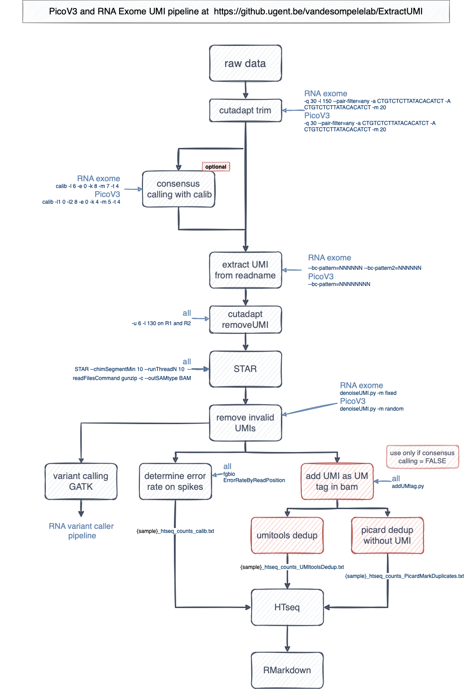

# Important note
The picoV3 and RNA Exome UMI pipelines are developed and maintained by Jasper Anckaert, Jasper Verwilt, Baraa Orabi (University of British Columbia) and Ruben Van Paemel and is (06/2021) unpublished. If you would use this pipeline in a manuscript before the publication, please contact us beforehand. 

# UMI pipeline for PicoV3 and RNA Exome



## Installation

```bash
cd $VSC_DATA_VO_USER
git clone git@github.ugent.be:vandesompelelab/ExtractUMI.git
cd ExtractUMI
```

If it's the first time that you run the pipeline, you will need to install some python modules

```bash
ml load Python/3.6.6-intel-2018b
pip install pandas numpy biopython pysam --user

python submit_UMIanalysis_slurm.py -h
```

Example submission line for RNA Exome:

```bash
ml load Python/3.6.6-intel-2018b
python ./20210527_ExtractUMI/submit_UMIanalysis_slurm.py \
       -t pe -b /folder/to/fastq -g hg38 -u mail@ugent.be \
       -o output_folder \
       -s RNA -m fastq -l UMI_list_RNA_exome.txt -a RNAexome -c yes
```

Your `/folder/to/fastq` needs to contain *folders* with the fastqs files, e.g.

```bash
tree /folder/to/fastq

/folder/to/fastq
├── RNA014141-143226
│   ├── RNA014141_S43_R1_001.fastq.gz
│   └── RNA014141_S43_R2_001.fastq.gz
├── RNA014142-143226
│   ├── RNA014142_S44_R1_001.fastq.gz
│   └── RNA014142_S44_R2_001.fastq.gz
├── RNA014143-143226
│   ├── RNA014143_S45_R1_001.fastq.gz
│   └── RNA014143_S45_R2_001.fastq.gz
├── RNA014144-143226
│   ├── RNA014144_S46_R1_001.fastq.gz
│   └── RNA014144_S46_R2_001.fastq.gz
...
```

After the pipeline has finished, you can run MultiQC, download the results to your computer, excluding the larger files with

```bash
Rsync -zvar --exclude="*gz" --exclude="*fa" --exclude="*sam" --exclude="*bam" --exclude="*/*junction*" --exclude="*bai" --exclude="*tmp*" --exclude="*bai" --exclude="*.out" --exclude="*/fastqc*" --exclude="*/*mate*" --exclude="*/*STARgenome*" --exclude="*/*mate*" --exclude="*/*coverage*" --exclude="*/*msa*" --exclude="*/*fastq*" --exclude="*/*cluster*" hpc:/PATH .
```

- Example data-analysis can be found at https://github.ugent.be/pages/vandesompelelab/RVP1908_UMI/Markdowns/RVP1908_analysis.html
- Example multiQC report is under `examples/` in this Github.

## Variant calling

After the pipeline has finished, variant calling can be performed with the pipeline at https://github.ugent.be/vandesompelelab/RNA_variant_caller 

## Other scripts

- `sampleLoop.sh`: subsample fastq files to the levels specified in the script
- `addUMtag.py`: obtain UMI sequence from read name and add it as an 'UM' tag in the bam file
- `UMI_trim_RNA_exome.py`: see below
- `denoiseUMI.py`: see below

# UMI_trim_RNA_exome.py
## Usage
```
Extracts UMIs from RNA exome data.

This program takes a list of UMIs as input and checks whether a read begins with any of those UMIs (FASTQ) or if the end of the read name contains a UMI sequence (BAM).

FASTQ-mode: The UMI is extracted from the read and added to the read name, and 8 nt are trimmed off.
BAM-mode: The UMI is extracted from the read name and added as a "UM" tag.

If a UMI is 6 nt, there is an N added to the UMI (so eventually all the UMIs are 7 nt long). Reads that do not begin with a UMI are discarded.

       [-h] -i INPUT -o OUTPUT -u UMIFILE

required arguments:
  -h, --help            show this help message and exit
  -i INPUT, --input INPUT
                        .fastq.gz or sorted and indexed bam file
  -o OUTPUT, --output OUTPUT
                        .fastq.gz file (will be gzipped) or bam file
  -u UMIFILE, --umifile UMIFILE
                        .txt file with UMI sequence on each line
optional arguments:
  -b, --bam             if input is bam file
```

## Example
### FASTQ mode
```bash
$ zcat example/UMI_test.fastq.gz
@NS500361:609:HYGWWBGX9:1:11101:5989:1161 1:N:0:CGTACTAG+TCTTACGC
TGATAGGTGTCACTGTGGTCTTAGGGGGTGCCCTCCCCGAGGCCTGGCTTATGGTGGTGGCCAGGGCCCTCGTCA
+
AAEEAEAEAAEEAEAAE/EEEEEEEAEEEEAE/EEEAEEEEEAEEEEEEEEEAEEEEEEEAEEEEAEEAEEEEEA

$ python UMI_trim_RNA_exome.py -i example/UMI_test.fastq.gz -o UMI_test_extract.fastq.gz -u UMI_list_RNA_exome.txt
ExtractUMI

       Running in FASTQ mode.
       Input: example/UMI_test.fastq.gz
       Output: test.fastq.gz
       UMI file: UMI_list_RNA_exome.txt

Finished running. Runtime 0.10 seconds.

$ zcat UMI_test_extract.fastq.gz
@NS500361:609:HYGWWBGX9:1:11101:5989:1161 1:N:0:CGTACTAG+TCTTACGC_TGATAGN
GTCACTGTGGTCTTAGGGGGTGCCCTCCCCGAGGCCTGGCTTATGGTGGTGGCCAGGGCCCTCGTCA
+
AAEEAEAAE/EEEEEEEAEEEEAE/EEEAEEEEEAEEEEEEEEEAEEEEEEEAEEEEAEEAEEEEEA
```

### BAM mode
```bash
# bam-file should be preprocessed with UMI-tools extract and then sorted by coordinate and indexed.

$ samtools view example/UMI_test.bam
NS500361:609:HYGWWBGX9:4:12511:8000:3159_CTTCCTGT       16      chr1    12359   255     63M     *  00       TGGAGGGAGGGGCTCAGCAGGTCTGGCTTTGGCCCTGGGAGAGCAGGTGGAAGATCAGGCAGG AAAEAAAEAEEEA/EEEEEEE6EEEEEA
EEEEEEEEEEEEEEEEEEEAEEEEEEAEEEEEEEE     XA:i:0  MD:Z:63 NM:i:0  XM:i:9

$ python UMI_trim_RNA_exome.py -i example/UMI_test.bam -o outtest.bam -u UMI_list_RNA_exome.txt --bam

ExtractUMI

       Running in BAM mode.
       Input: example/UMI_test.bam
       Output: test.bam
       UMI file: UMI_list_RNA_exome.txt

Finished running. Runtime 0.11 seconds.

$ samtools view outtest.bam
NS500361:609:HYGWWBGX9:4:12511:8000:3159_CTTCCTGT       16      chr1    12359   255     63M     *  00       TGGAGGGAGGGGCTCAGCAGGTCTGGCTTTGGCCCTGGGAGAGCAGGTGGAAGATCAGGCAGG AAAEAAAEAEEEA/EEEEEEE6EEEEEA
EEEEEEEEEEEEEEEEEEEAEEEEEEAEEEEEEEE     XA:i:0  MD:Z:63 NM:i:0  XM:i:9  UM:Z:CTTCCTG
```

## Dependencies
Tested with:
- python==3.6
- pandas==0.24.1
- numpy==1.16.2
- biopython==1.73
- argparse==1.1
- pysam==0.14.1

## Contact
Ruben.VanPaemel@UGent.be


# denoiseUMI.py
## Usage
```
usage: Extracts UMIs from RNA exome UMI data (not compatible with other UMI types).

This program takes a list of UMIs as input and checks whether a read in bam file contains a UMI in a user-provided list. If there is no match, that read is discarded.

If a UMI is 7 nt, they are trimmed to the first 6 nt.

The UMI reference file only needs to contain the R1 UMI. If the data is paired end, all combinations are automatically generated from that for PE reads (e.g. 120 UMIs in SE sequencing = 120^2 UMIs in PE sequencing). This requires of course that the UMIs in R1 and R2 are identical.

The program requires that the UMI is encoded in the read name (e.g. NS500361:616:HJ3LFAFXY:3:21412:2959:9891_TACCTGGAACCT), which is automatically done if the fastq was preprocessed with umitools.

       [-h] -i INPUT -o OUTPUTFOLDER -u UMIFILE -p

optional arguments:
  -h, --help            show this help message and exit
  -i INPUT, --input INPUT
                        sorted and indexed bam file
  -o OUTPUTFOLDER, --outputfolder OUTPUTFOLDER
                        bam file after umitools dedup
  -u UMIFILE, --umifile UMIFILE
                        .txt file with UMI sequence on each line
  -p, --paired          if paired end reads

```
## Example
```bash
$ python denoiseUMI.py -i bamfileAfterUMItoolsdedup.bam -o example/ -u UMI_list_RNA_exome.txt --paired

denoiseUMI
    Input: bamfileAfterUMItoolsdedup
    Output folder: example
    Output file: example/bamfileAfterUMItoolsdedup_noNoise.bam
    UMI reference file: UMI_list_RNA_exome.txt
    Log files:
        Kept UMIs: example/bamfileAfterUMItoolsdedup_noNoise_keptUMIs.txt
        Removed UMIs: example/bamfileAfterUMItoolsdedup_noNoise_removedUMIs.txt
    Paired end: True

0 lines processed...
100000 lines processed...

Finished running. Runtime 101.07 seconds.
Total number of reads in bam file: 99705
Total number of reads kept: 95041 (95.32%)
Total number of reads rejected: 4664 (4.68%)
```

## Dependencies
Tested with:
- python==3.6
- pandas==0.24.1
- numpy==1.16.2
- biopython==1.73
- argparse==1.1
- pysam==0.14.1
